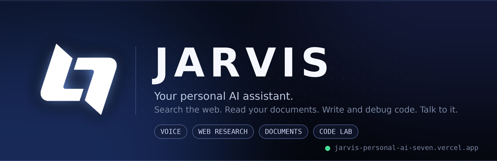
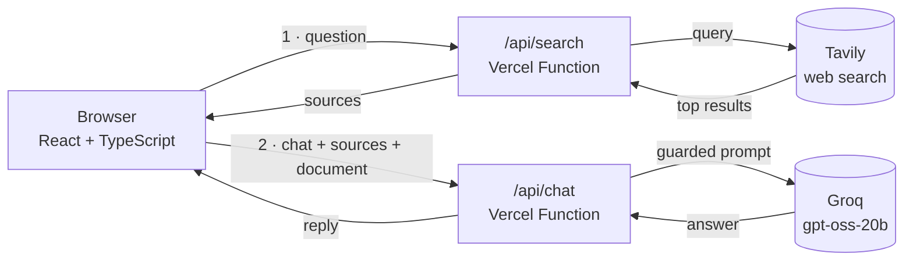

<div align="center">



<br />

<a href="https://jarvis-personal-ai-seven.vercel.app">
  
</a>

<br /><br />


**A calm, capable AI workspace.** Ask questions, research the live web, read your documents, write and debug code — by typing or by talking.

[**Open Jarvis**](https://jarvis-personal-ai-seven.vercel.app) · [Features](#-what-jarvis-can-do) · [How it works](#-how-it-works) · [Run it locally](#-run-it-locally) · [Deploy](#-deploy-your-own-on-vercel)

</div>

---

> **About the live demo.** The chat is protected by an access code so that strangers can't spend my AI quota. You can open the site and explore the interface freely; to chat, ask me for the code on GitHub ([@Btwitsikaris](https://github.com/Btwitsikaris)) — or deploy your own copy in about five minutes using the guide below.

## ✨ What Jarvis can do

| | Feature | Details |
|---|---|---|
| 💬 | **Three working modes** | *General* for everyday questions, *College / Project* for research, planning and viva prep, *Code Lab* for debugging and clean, complete code. |
| 🌐 | **Live web research** | Time-sensitive questions trigger a Tavily search. Sources appear as cards under the answer and are cited inline as `[1]`, `[2]`. |
| 📄 | **Document understanding** | Attach a **PDF, TXT, MD, CSV or JSON** file. PDFs are parsed *in your browser* with a bundled copy of pdf.js, and the document stays attached for follow-up questions. |
| 🎙️ | **Voice in, voice out** | Speak your question with the microphone, then have any reply read aloud. Uses the browser's Web Speech API (best in Chrome or Edge). |
| 🌌 | **3D landing experience** | An interactive Three.js scene and looping hero built with Framer Motion. |
| 🗂️ | **Private chat history** | Conversations are saved only in *your* browser's `localStorage`. Jarvis has no database. (Your messages are, of course, sent to Groq to generate answers, and to Tavily when a search is needed.) |
| 🛡️ | **Hardened API** | Access-code gate, per-IP rate limits, input validation and prompt-injection defences (see [Security](#-security-by-design)). |

### Try asking

```text
What's the latest news about space exploration this week?      → triggers live web search
Summarise the attached PDF in five bullet points               → document mode
Why does my useEffect run twice?  (switch to Code Lab)         → code mode
Help me plan my final-year project timeline  (College mode)    → project mode
```

## 🧭 How it works

Every message takes one or two trips to a small serverless backend. Your API keys never leave the server.



1. **Search (only when useful).** With *Web AUTO* on, questions that look time-sensitive go to `/api/search` first. If search is unavailable, Jarvis still answers and tells you the answer may be out of date.
2. **Chat.** The browser sends the recent conversation, any sources, and the attached document to `/api/chat`, which builds the system prompt on the server and calls Groq.
3. **Guard.** Both functions pass through `api/_lib/guard.js` first: method → origin → rate limit → access code → body validation.

## 🧰 Tech stack

| Layer | Tools |
|---|---|
| **Frontend** | React 18, TypeScript, Vite 6, Framer Motion, Three.js, `react-markdown` + `remark-gfm`, lucide-react |
| **Documents** | `pdfjs-dist` (bundled locally, no CDN) |
| **Backend** | Vercel Serverless Functions (Node, ES modules) |
| **AI model** | [Groq](https://groq.com) · `openai/gpt-oss-20b` |
| **Web search** | [Tavily](https://tavily.com) |
| **Hosting** | Vercel |

## 🛡️ Security by design

Jarvis holds real API keys, so the backend is built to be hard to abuse:

- **Keys stay server-side.** They live in Vercel environment variables and are never sent to the browser.
- **Access-code gate.** Compared in constant time, with failed attempts throttled.
- **Same-origin only.** Requests from other websites are rejected.
- **Rate limiting.** Per-IP limits on every route.
- **Strict input validation.** Types, message counts and lengths are all capped before anything reaches the model.
- **Prompt-injection defences.** Web results and uploaded documents are passed to the model as clearly delimited, *untrusted* data, and the model is told never to follow instructions inside them.
- **No data-leak tricks.** Markdown images in replies are blocked, and links open with `noopener noreferrer`.
- **Strong browser headers.** A strict Content-Security-Policy, HSTS and a Permissions-Policy that allows only the microphone.
- **Local-only history.** Chats are stored in your browser, not in a database.

> The built-in rate limiter works per serverless instance (best effort). For hard limits, add a Vercel Firewall rate-limit rule on `/api/*`.

## 💻 Run it locally

**You need:** Node.js 18+ and free API keys from [Groq](https://console.groq.com/keys) and [Tavily](https://app.tavily.com).

```bash
git clone https://github.com/Btwitsikaris/Jarvis-Personal-AI-.git
cd Jarvis-Personal-AI-/jarvis

npm install
cp .env.example .env        # Windows (PowerShell): copy .env.example .env
```

Open `.env` and fill in your keys, then start the dev server:

```bash
npm run dev
```

Visit **http://localhost:5173**. During development, Vite serves the same `/api` handlers that run on Vercel, so everything works locally.

### Environment variables

| Name | Required | Purpose |
|---|:---:|---|
| `GROQ_API_KEY` | ✅ | Powers the chat model |
| `TAVILY_API_KEY` | ✅ for web search | Powers live web research |
| `ACCESS_CODE` | recommended | Passphrase needed to use the API; the app asks for it once per browser |
| `RATE_LIMIT_PER_MIN` | optional | Requests per minute per IP, per route (default `20`) |
| `ALLOWED_ORIGINS` | optional | Extra allowed origins if you use a custom domain |
| `GROQ_MODEL` | optional | Override the model (default `openai/gpt-oss-20b`) |

> Never prefix these with `VITE_` — that would expose them to the browser.

## 🚀 Deploy your own on Vercel

1. Fork or push this repo to your GitHub account.
2. In Vercel, click **Add New → Project** and import the repo.
3. Set **Root Directory** to `jarvis` (the app lives in that subfolder). The framework preset should auto-detect as **Vite**.
4. Add `GROQ_API_KEY`, `TAVILY_API_KEY` and `ACCESS_CODE` under **Environment Variables**.
5. Click **Deploy**.

Changed an environment variable later? Redeploy. Every deployment keeps its own copy of the settings, and `your-project.vercel.app` always points to the newest one.

<details>
<summary><b>🔧 Troubleshooting</b></summary>

<br />

| What you see | Why, and the fix |
|---|---|
| *"The server's AI key was rejected"* | Groq refused `GROQ_API_KEY`. Create a fresh key, update it in Vercel, and redeploy. Test on the main `*.vercel.app` address, not an old per-deployment link. |
| *"A valid access code is required"* | The code you entered doesn't match `ACCESS_CODE`. Check it in Vercel, or clear the saved code by clearing the site's data. |
| *"Missing GROQ_API_KEY on the server"* | The variable isn't set for that environment. Add it and redeploy. |
| Web search seems to do nothing | Search runs for time-sensitive questions, and needs `TAVILY_API_KEY`. If search fails, Jarvis says so in its answer. |
| Microphone won't start | Use Chrome or Edge, and allow microphone access in the site settings. |
| Build fails on Vercel | Make sure **Root Directory** is `jarvis`. |

</details>

<details>
<summary><b>📁 Project structure</b></summary>

<br />

```text
Jarvis-Personal-AI-/
├── README.md
├── docs/
│   └── banner.png
└── jarvis/
    ├── api/
    │   ├── chat.js            # builds the prompt server-side, calls Groq
    │   ├── search.js          # Tavily web search
    │   └── _lib/guard.js      # origin, rate limit, access code, validation
    ├── public/assets/         # logo and hero loop
    ├── src/
    │   ├── App.tsx            # landing page + chat interface
    │   ├── App.css
    │   ├── index.css
    │   ├── main.tsx
    │   └── components/
    │       ├── ErrorBoundary.tsx
    │       ├── JarvisThreeScene.tsx
    │       └── LandingBackground.tsx
    ├── index.html
    ├── vercel.json            # security headers and routing
    ├── vite.config.ts         # also serves /api during local dev
    └── .env.example
```

</details>

## 🔭 Ideas for later

- Streaming replies so answers appear word by word
- Keeping uploaded documents available across chats
- Exporting a conversation as Markdown or PDF
- More specialised modes

## 👤 Author

**Aniket** — building things where frontend, backend and AI meet.

[](https://github.com/Btwitsikaris)

<div align="center">

<sub>If Jarvis helped or inspired you, a ⭐ on the repo means a lot.</sub>

</div>
